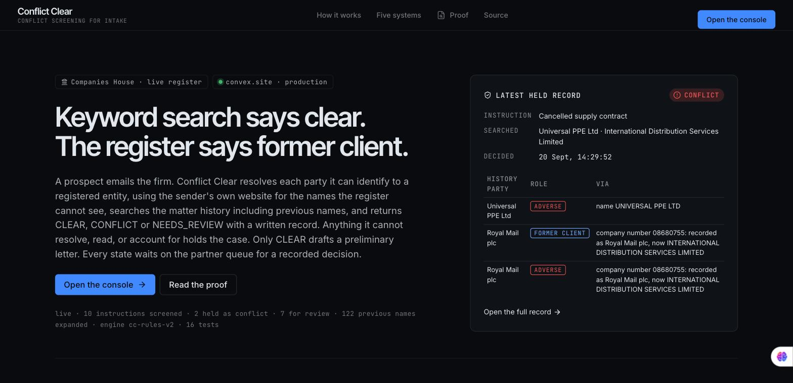
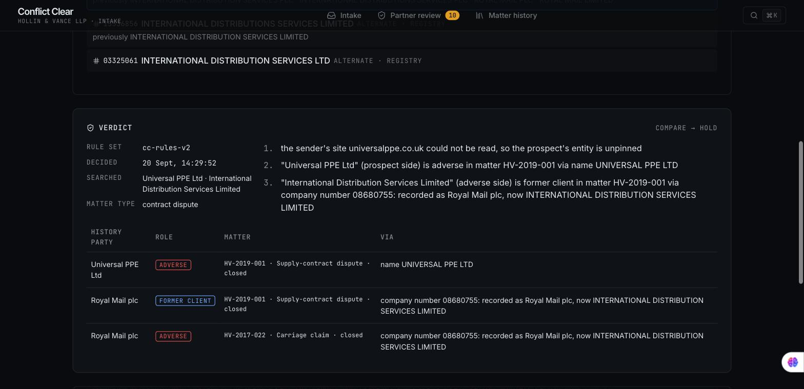
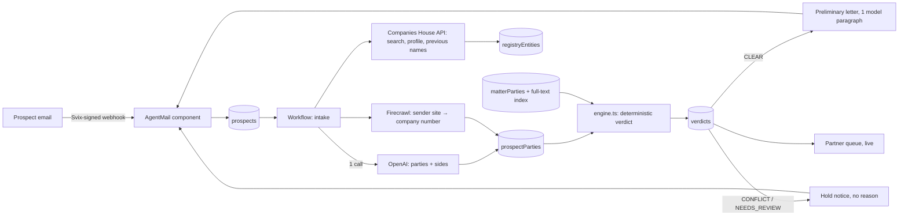

<div align="center">



&nbsp;

[](LICENSE)
[](https://github.com/Cassxbt/convex-conflict/actions/workflows/ci.yml)


### You run intake at a small firm, or you are the firm. An instruction lands at 9:04 and needs an answer before lunch. Each named party is resolved to a registered entity or the case is held; matter history is searched across current and previous names, and only CLEAR can draft a preliminary letter.

Keyword conflict searches miss the company that changed its name. Company 08680755 was **Royal Mail plc** until 2022 and is **International Distribution Services Limited** today; a firm that acted for Royal Mail still holds its confidences, and a search for the new name returns nothing. Conflict Clear returns CONFLICT via the company number.

**[ Live ↗ ](https://descriptive-goldfish-956.convex.site)** · **[ Proof ↗ ](https://descriptive-goldfish-956.convex.site/#/proof)** · **[ Judge it in 90 seconds ↗ ](#judge-it-in-90-seconds)** · **[ Build log ↗ ](hackathon.md)**

</div>

## ▶ Demo



Every product shot in the submission video comes from the live deployment. An instruction from "Universal PPE Ltd" asks the firm to sue "International Distribution Services Limited". The register resolves the target to 08680755 and lists its previous names; the engine matches the company number against the firm's history, finds it recorded as Royal Mail plc, a former client, and holds the case. The console records a prospect-facing hold notice with no confidential reason, and the partner receives the full receipt.

Video walkthrough: in production. The final public link will replace this line before submission.

## Contents

- [Judge it in 90 seconds](#judge-it-in-90-seconds)
- [The problem](#the-problem)
- [What I built](#what-i-built)
- [Verify it yourself in 30 seconds](#verify-it-yourself-in-30-seconds)
- [Five systems, and what breaks without each](#five-systems-and-what-breaks-without-each)
- [Architecture](#architecture)
- [Success and refusal, on the live deployment](#success-and-refusal-on-the-live-deployment)
- [What is real, and what is not](#what-is-real-and-what-is-not)
- [Tests, local run, layout](#tests-local-run-layout)

## Judge it in 90 seconds

1. Open the [live site](https://descriptive-goldfish-956.convex.site) and press **Run the conflict example** (or open [#/run/conflict](https://descriptive-goldfish-956.convex.site/#/run/conflict)). It files a fictional instruction and opens its record while it resolves against the live register; no mailbox or key needed. The lead card is the latest held record, read live from the deployment.
2. Open the stable [CONFLICT receipt](https://descriptive-goldfish-956.convex.site/#/record/jh7811bz2kekrs1jh3gqb00sg98etqrd). Company 08680755 links the adverse party's current name to Royal Mail plc in the firm's history; the receipt also shows every other hold reason.
3. Open the stable [CLEAR receipt](https://descriptive-goldfish-956.convex.site/#/record/jh78w6f3m7366x7d680v6vn0ks8ersdz). Both parties resolved, the only history hit is the prospect itself in a non-conflicting role, and the recorded letter says the screen is preliminary.
4. Optionally press ⌘K and run the **Clear example**. It can correctly hold if its website evidence is temporarily unavailable; fail-closed behaviour is deliberate.
5. Try to break the intake with a company that does not exist, "Royal Mail" by name only, or a corporate sender site that cannot be read. Each holds.
6. Open [/proof](https://descriptive-goldfish-956.convex.site/#/proof), or `curl` the JSON below. Every number is a live query.

## The problem

Conflict checking is required before a solicitor takes an instruction. The SRA's own guidance says it normally runs on a database that identifies "previous or current clients and related names and businesses". In practice, small firms search a name. Names change. Brands trade under a different legal entity. A search on the name in the prospect's email returns nothing, and the firm engages against a former client it still owes confidentiality to.

Three specific ways a keyword search fails, each reproduced on the live deployment:

- **Renamed company.** Royal Mail plc → International Distribution Services Limited (08680755).
- **Brand ≠ legal entity.** A register search for "The Whisky Exchange" returns *The Whisky Exchange Limited* (14220596). The trading page says *Speciality Drinks Limited* (04449145). Wrong entity, wrong history.
- **Near-namesake.** A claim against "Sandhurst Bakery" when Sandhurst Bakeries Ltd is a current client.

## What I built

**Extract → Expand → Compare → Hold or clear.** One named mechanism, one closed loop, no model in the decision.

1. **Extract.** The email arrives in the case inbox through a signed AgentMail webhook. One structured-output call lists the parties and which side each is on. It does not infer entities and never sees the history. A deterministic scan for company-shaped names checks it did not drop one.
2. **Expand.** Each name is searched on Companies House; every candidate's current and previous names are fetched. Firecrawl reads the sender's own homepage and terms page and pins the brand to the registered number it actually trades under.
3. **Compare.** `shared/engine.ts` matches every alias against the firm's matter parties by company number and normalised name. A prospect who was once adverse, or an opponent who was once a client, is a conflict. A name match across different registered numbers is a lead, not an identity. Ambiguity, an unresolved name, an unreadable sender site, or a site with no registered number all hold the case.
4. **Hold or clear.** CLEAR drafts a preliminary letter into the thread. CONFLICT and NEEDS_REVIEW send a hold notice that gives no reason. Every state lands on the partner queue for a recorded decision; the engine's verdict is never overwritten.
5. **Re-screen.** A screen is only as current as the history it ran against. A nightly cron re-runs the compare step for every record no solicitor has decided yet, through a workpool so it never competes with live intake. A record only moves towards a hold, new matches are appended beside the original ones, and a decided record is never touched.

Verdict vocabulary a judge can tick: `CLEAR` · `CONFLICT` · `NEEDS_REVIEW`, rule set `cc-rules-v2`.

## Verify it yourself in 30 seconds

```bash
curl -s https://descriptive-goldfish-956.convex.site/api/proof | head -30
# → {"live": true, "screened": <live count>, "realInbound": <live count>, "byVerdict": {...}, "ruleVersion": "cc-rules-v2", ...}

git clone https://github.com/Cassxbt/convex-conflict && cd convex-conflict && npm install && npm run verify
# → engine tests: 18 passed · then eight live checks against the deployment, each ok or FAIL
```

`npm run verify` needs no keys. It fails if the README claims something the live deployment does not hold: no CLEAR, no CONFLICT via a previous-name hop, no email answered, wrong rule set.

Open any record by id from that JSON: `https://descriptive-goldfish-956.convex.site/#/record/<id>`. Console records are fictional and fully open. Records that arrived by email show sender domain, verdict and registered candidates only; the rest needs the staff passphrase.

Or send a real email to the case inbox named on the [live site](https://descriptive-goldfish-956.convex.site/#/app) and watch it appear on the board.

## Five systems, and what breaks without each

| System | Job in the mechanism | Remove it and… |
|---|---|---|
| **AgentMail** | The prospect's email is the trigger. `handleWebhook` (Svix-verified, deduplicated) creates the case; the sender domain seeds resolution; `replyToMessage` puts the letter on the same thread. Component: `components/agentmail` (vendored, see [NOTICE](NOTICE)). | There is no intake event, no sender domain, no channel for the letter. No front door. |
| **Firecrawl** | `FirecrawlClient.scrape` on the sender's homepage and terms page lifts the registered company number and legal name. `convex/resolve.ts`. | "The Whisky Exchange" resolves to 14220596 instead of 04449145. Wrong history, false CLEAR. `scripts/preflight-gate.ts` runs this differential against the deployed action. |
| **Companies House API** | Search, profiles, previous names, status. `shared/companiesHouse.ts`. Not a sponsor; the register has an API, so nothing is scraped from it. | The Royal Mail hop is never made. |
| **OpenAI** | Two bounded structured-output calls: party extraction (`convex/extract.ts`) and one neutral paragraph for CLEAR letters. | Nothing is extracted, so every case holds for a human to list the parties. The verdict logic is untouched. |
| **Convex** | Durable workflow (`@convex-dev/workflow`), nightly re-screen cron through a workpool, matter history with a full-text index, verdict record with rule version and timestamp, partner queue, live two-role board, static hosting, webhooks, rate limiting. Six components registered. | No record of who was searched, what was found, and who decided. |

## Architecture



Trust boundaries: the model sees the email and the verdict object, never the history. The verdict is computed inside one mutation over the firm's current history. Any failure in the loop records the error on the case; a post-verdict failure downgrades CLEAR to review.

## Success and refusal, on the live deployment

| Case | Verdict | Why | Record |
|---|---|---|---|
| Ocado Retail v Reed Boardall Cold Storage | CLEAR | Ocado pinned from ocado.com (03875000); Reed Boardall 00995076 resolved; the only history hit is Ocado itself as a former client on the prospect side, not an adverse-side client conflict | [open](https://descriptive-goldfish-956.convex.site/#/record/jh78w6f3m7366x7d680v6vn0ks8ersdz) |
| Universal PPE v International Distribution Services | CONFLICT | 08680755 recorded as Royal Mail plc, former client; prospect was the adverse party in the same matter | [open](https://descriptive-goldfish-956.convex.site/#/record/jh7fgsa623j9hmydtn39h9e7wn8esw82) |
| Franchisee v "Timpson" | NEEDS_REVIEW | resolves to Timpson Ltd 00675216, but Timpson Group (02339274) is a former client | [open](https://descriptive-goldfish-956.convex.site/#/record/jh7ap1jehtgb8791xj2780bkws8eryv4) |
| "Royal Mail" by name only | NEEDS_REVIEW | resolves to the current Royal Mail Limited 14240638; the former client is 08680755, different number | [open](https://descriptive-goldfish-956.convex.site/#/record/jh773hnttt6fne3fa8vrbq90b18esxa3) |
| Sender site cannot be read | NEEDS_REVIEW | prospect's entity unpinned | [open](https://descriptive-goldfish-956.convex.site/#/record/jh71ztyd5nrg3crhe8rn2b7bfd8esqga) |
| Company that does not exist | NEEDS_REVIEW | no registry entity | [open](https://descriptive-goldfish-956.convex.site/#/record/jh76pqj0n87e9pa7yz5wrxt5w58er3qt) |
| Near-namesake of a current client | NEEDS_REVIEW | full-text hit on Sandhurst Bakeries Ltd, current client | [open](https://descriptive-goldfish-956.convex.site/#/record/jh7b4gr8djcx1rjs1q1pbfacax8esg1d) |
| Real email from a non-company domain | NEEDS_REVIEW | arrived through the webhook; sender domain is not the company it names | [open](https://descriptive-goldfish-956.convex.site/#/record/jh7324dye36bz3raks6w53707h8er1w1) (restricted) |

The [proof page](https://descriptive-goldfish-956.convex.site/#/proof) lists every record and states each check as `VERIFIED HERE`, `REPORTED, NOT VERIFIED HERE`, or `NOT PRESENT HERE`.

## What is real, and what is not

| Capability | Status |
|---|---|
| Companies House data | **Real.** Live API; previous names, status and numbers are the register's. Profiles cached 24h. |
| Website evidence | **Real.** Firecrawl reads the sender's homepage and terms page when the sender has a corporate domain; URL, snippet and time are on the record. Free-mail and reserved domains are skipped. |
| Email round trip | **Real.** Signed AgentMail webhook in; replies are handed to AgentMail on the original thread, and delivery state is read from the component's outbound table. Console records are marked `demo`: the letter is recorded, not sent. |
| The firm and its matters | **Fictional.** Hollin & Vance LLP does not exist. Twelve seeded matters; the company names and numbers in them are real. |
| The verdict | **Deterministic.** `cc-rules-v2`, 18 tests, no model in the loop. Its inputs come from a model call plus a deterministic completeness scan; a missed person or trading name is a known limit. |
| Sign-off | **Recorded, not enforced by identity.** Every verdict waits on the partner queue; a named reviewer records a decision. CLEAR's letter goes out first and says it is preliminary. |
| Access | **Open, with guards.** Console rate-limited (burst 4, 6/min, 60/h), bodies capped, records public and fictional. Email-originated records are restricted without `STAFF_KEY`. A firm would put all of it behind its identity provider. |
| Auth | **None.** Convex Auth v2 is alpha; the rules make auth optional. |
| Legal status | **A screening aid.** CLEAR is a recommendation to the supervising solicitor, who remains responsible under SRA Code paragraph 6. |

## Tests, local run, layout

```bash
npm install
npm test                                   # 18 engine tests, node:test, no keys
npm run verify                             # tests + eight live checks against the deployment, no keys
npx convex dev                             # creates a dev deployment
npx convex env set CH_API_KEY … OPENAI_API_KEY … FIRECRAWL_API_KEY … AGENTMAIL_API_KEY … AGENTMAIL_WEBHOOK_SECRET … AGENTMAIL_INBOX_ID … STAFF_KEY …
npx convex run seed:seedMatters            # the fictional firm
npx @convex-dev/static-hosting setup && npm run deploy
node --experimental-strip-types scripts/preflight-gate.ts   # the Firecrawl differential, live
```

Register the AgentMail webhook at `https://<deployment>.convex.site/agentmail/webhook` for `message.received`.

```
convex/        schema, http (webhook + /api/proof), email, intake workflow, recheck + crons, registry, resolve, extract, letters, board, demo, seed
shared/        engine.ts (verdict), companiesHouse.ts
components/    agentmail (vendored, Apache-2.0)
src/           front page, console, record, review, proof (Vite + React on Convex static hosting)
test/          engine tests
scripts/       pre-flight scripts, including the Firecrawl differential
design.md      the locked design system
hackathon.md   the build log judges read
```

---

Built for the **Convex All Gas Hackathon** with Convex, AgentMail, Firecrawl and OpenAI. MIT licensed; `components/agentmail` is Apache-2.0, see [NOTICE](NOTICE). By [cassxbt](https://github.com/Cassxbt).
